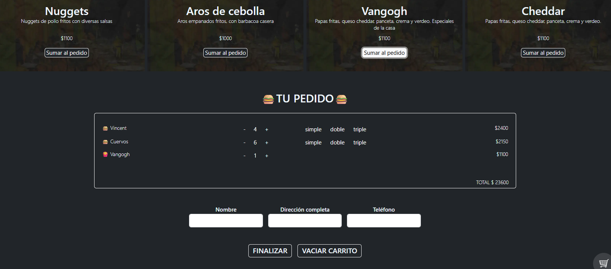

# ECOMMERCE JAVASCRIPT DEMO

## 🇬🇧 English

This is a **single-page e-commerce-style demo site** built with HTML, CSS, Bootstrap, and JavaScript. It allows users to dynamically browse products, add them to a cart, remove them, and modify product content (such as hamburger layers). Although there's no backend or server connection, the app **fetches product data from a local JSON file**, simulating a basic dynamic front-end database.

### ✨ About the Project

This project was created as the **final assignment of a foundational JavaScript course**. Both the **design** and **development** were done entirely by me.

### ⚙️ Key Features

- Built with **HTML**, **CSS**, **JavaScript**, and **Bootstrap**
- **Dynamic product rendering** from a local `JSON` file
- Interactive shopping cart: add, remove, clear
- Product customization (e.g., hamburger layers)
- **Toast notifications** using the **Toastify** library
- Responsive design using Bootstrap (*though responsiveness was not a main focus*)

### 📌 Notes

This is not a real e-commerce site. The main goal was to showcase **core JavaScript concepts** like DOM manipulation, event handling, and array operations in a practical, visual project. All data is handled on the client side.

 

## 🇪🇸 Español

Este es un sitio **demo de e-commerce de una sola página**, realizado con HTML, CSS, Bootstrap y JavaScript. Permite a los usuarios recorrer productos, agregarlos al carrito, eliminarlos, vaciar el carrito y modificar características como las capas de las hamburguesas. Aunque no hay conexión con un servidor ni backend, la app **obtiene los datos desde un archivo JSON local**, simulando una base de datos dinámica en el front-end.

### ✨ Sobre el Proyecto

Este proyecto fue desarrollado como **trabajo final de un curso formativo básico de JavaScript**. Tanto el **diseño** como el **desarrollo** fueron realizados completamente por mí.

### ⚙️ Funcionalidades principales

- Realizado con **HTML**, **CSS**, **JavaScript** y **Bootstrap**
- **Renderizado dinámico de productos** desde un archivo `JSON` local
- Carrito interactivo: agregar, eliminar, vaciar
- Personalización de productos (por ejemplo, capas de hamburguesa)
- **Notificaciones emergentes** usando la librería **Toastify**
- Diseño responsive con Bootstrap (*aunque no fue un objetivo principal del proyecto*)

### 📌 Notas

Este proyecto no es un sitio de e-commerce real. Su objetivo fue aplicar y mostrar **conceptos clave de JavaScript** como la manipulación del DOM, el manejo de eventos y arrays. Todos los datos están gestionados del lado del cliente y no hay lógica de backend.
